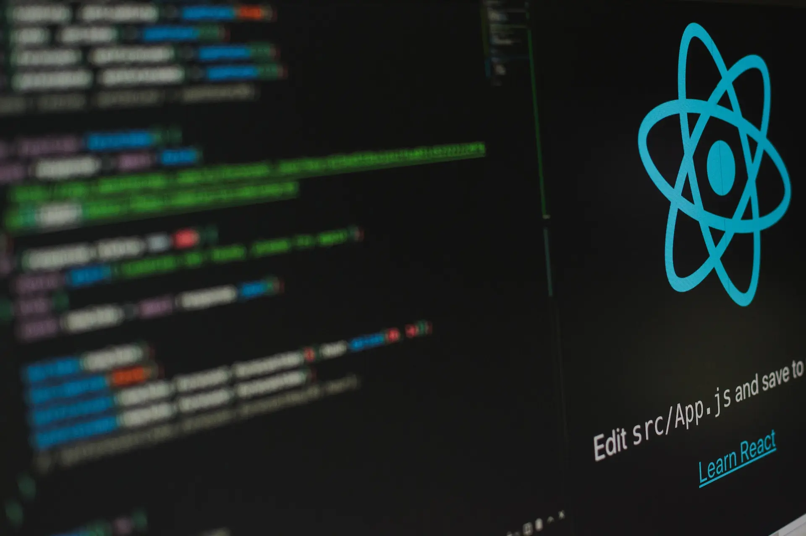
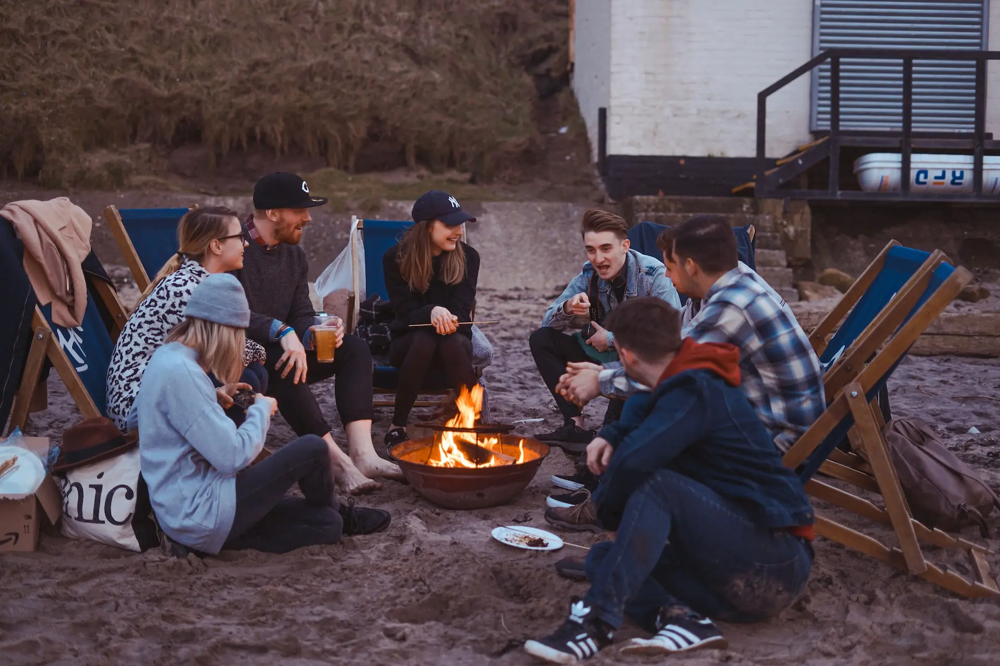
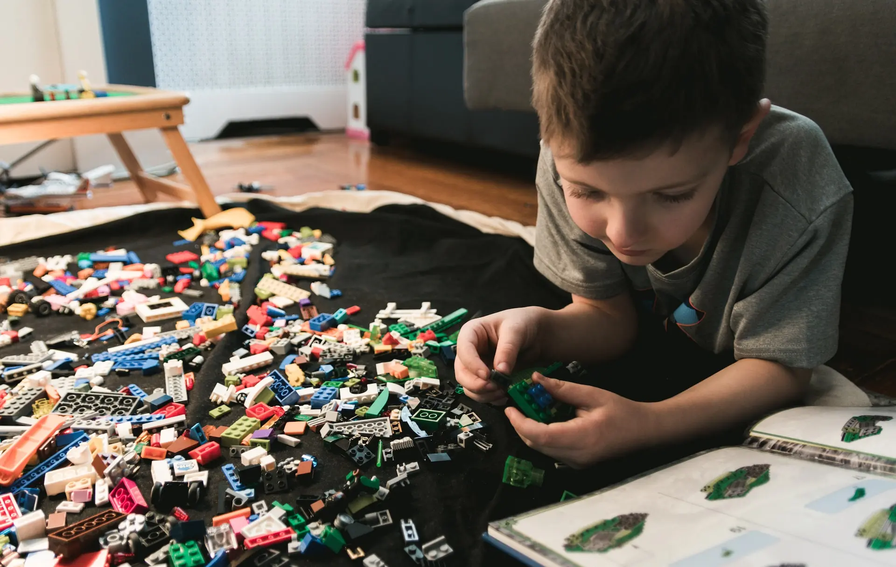
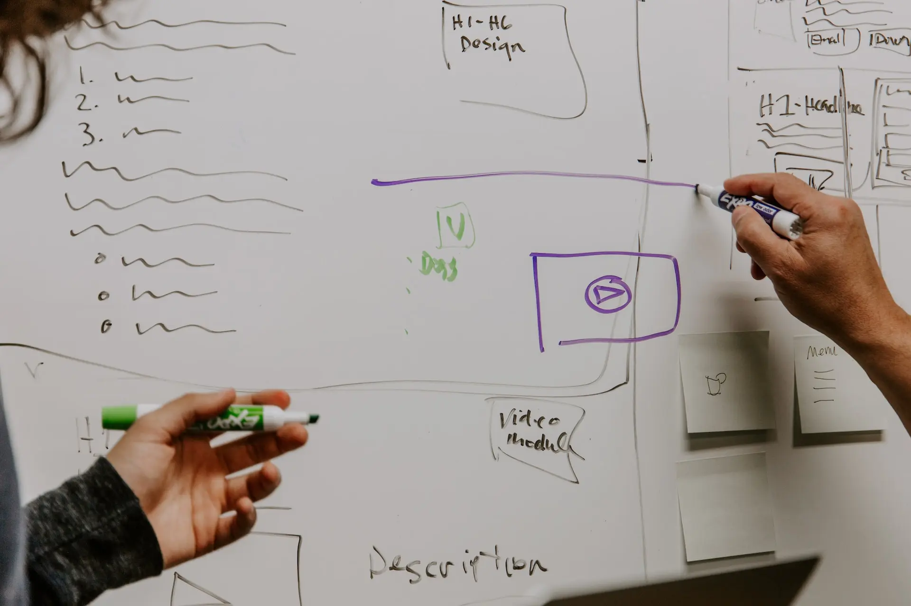

<!-- Interviewing is scary – or, at least, it is for the first 2-3 years. Those awful years where interviewing feels like a ground war to **prove your value** to companies and scratching every surface in order to show you're worth giving a shot – **It's not easy**, I've been there, but surprisingly, I got to be the one now actually **doing the interviews**. Let me explain.

Not only was I now the one sitting behind the chair asking the technical questions, I was also the one determining if the candidate was **senior enough** to fit the role (more on this later). How crazy is that?

It wasn't all as straightforward as it might seem, there were so many things that added up for me to actually land that position, but the things **I learned** from my stay at that company, and doing that job, are simply priceless.

## How did I get there?

What's interesting the most, is that I wasn't **supposed** to be an interviewer – at the time of me interviewing with that company, I was applying for the Senior Frontend Engineer position, that's what my whole interview pipeline was targeted towards, specifically, a [React](https://react.dev/) position.

I was asked about my React experience, went through a technical screening with technical React questions, and developed a take-home assignment where I used React to build an app that satisfied some specific requirements, **but it was more than that**. Apart from the usual process, some interesting things were added to the process:

- I was invited to a temporary **Slack channel**, with my interviewer, and some engineers from the company.
- I was expected to **communicate** my process, and ask for any kind of questions, doubts or blockers I faced with the assignment (spoiler alert: the project **had** ambiguous information that **should** get me to ask those questions).
- I was also being evaluated on how I received **feedback** from my interviewers – they are expected to share some small and subtle amounts of feedback to point the interviewee in the right direction without explicitly doing so.

And the fun thing is, I **did** land the job, however... Something unexpected happened, they **liked my communication and performance so much** that they actually proposed me **another whole position**, one that goes under the title of "Engineering Talent Advocate", a special set of engineers that not only contributed to internal codebases & toolings, but that are also a key role in the overall **talent acquisition process** of the company. This meant:

- Performing **technical interviews**.
- Being the one in the **Slack channels**, guiding the interviewee.
- Sending, reviewing, and proposing improvements for the **take-home assessments**.
- Working closely with **recruiters** & **technical sourcers**.
- Being the middle ground between the **development teams**, and the **candidates** for such teams.

Sounds like a lot, right? But let me tell you, it was quite the opposite, in fact, it was actually **one of the best jobs** I've ever had, and not only I'll share my experience, but **all of the things** I learned while being at that position, and how such things could help you on taking interviews like an **absolute expert**.

## A peek into my day-to-day

As a talent advocate, not only was I supposed to take over all of the responsibilities I mentioned above, I would also **own** and **manage** the **entire React hiring pipeline**, which in on itself was a **huge** responsibility, with lots of expectations. However, as fun and hard as it might sound, 90% of my day was... Mostly meetings.

Sounds pretty boring, right? To me it wasn't. One of the things that got me into accepting that role was how **burnt out** I was from coding and web development in general – it was like breathing fresh air, and I got to do one of the things I liked the most: **Talking to people**. Believe me, I couldn't stare at a code editor for more than an hour without getting highly fatigued.

I would wake up to a usual **daily standup** meeting with the whole discipline (talent advocates, recruiters, sourcers and engineering directors) to have a look at the overall movement of the pipeline, seeing if there would be a need for more candidates, or if there's any changes to be made to the sourcing process. Discussing special cases as well was something really common to do.

The rest of the day would be, again, just meetings, mostly doing interviews, we would do **up to 4 interviews a day at most**, and checking/evaluating take-home assessments. Finally, I would spend some time of the day coding, and maintaining one of my core contributions to the team: A CLI that would automate the whole take-home assessment management. This is:

- Downloading a candidate's **repo**.
- **Setting up** the project (E.g. doing `npm install` and other configurations).
- Spinning up the **development server**.
- Tearing down if we **finished reviewing**.
- Archiving and cleaning up the project to **save space**.

As you can probably tell, I was **still** having some fun while coding, and it was enough for me to not get the burnout fatigue I was running away from. From all of these activities, I learned a **ton** of things I wish junior me had known from the start, which is why right here, right now, I'm compiling all of those life experiences I had after interviewing 100+ senior candidates at that company into **5 tips** that, I hope, can help you in your **upcoming interviews**.

## Tip 1: You are a story worth telling

And the interviewer is all about listening to it. Look, you might think you don't have anything amazing to say, **but you do**. It's not necessary to have built a million-dollar application, or a super-famous web service, or anything like that to feel like you have something to tell. The fact that you're taking an interview **is a sign** that you have at least a minimum amount of experience, and therefore, have lived stuff that's **worth sharing** – it's just a matter of **how** you share it.

As I always mention – it's not **what** you say, but **how** you say it. Communication is the most powerful tool you have at the palm of your hand, and you can make wonders with it, like for example, taking small things like stuff you learned while working on **a project**, people you met that left you **a lesson**, how you managed to get into programming and how you're looking forward to improve, and compiling them into a great story.

Like real life storytelling, there are ways to organize information in a way that **impacts** and leaves a **clear message**. Taking the interviewer on a journey through your experience is an almost guaranteed way of getting their **attention** and capturing their interest – just like a rollercoaster, with its ups, downs, tensions, and resolutions.

Take some time before your interview, think about yourself, what you have learned, what you have gone through, what things have shaped you into **what you are now** and what is **your goal**. Build a **timeline** that you can travel in simple terms, and take the interviewer with you. You **know yourself** better than **anyone else**, and if there's anyone that can show others how awesome you are, trust me, it's **you**.

## Tip 2: Think it out loud

I can't stress enough on how important it is to feel comfortable at speaking your **thoughts** and **ideas** while interviewing. Sure, you want to show seriousness and look professional, but we're not in an **interrogation room**. Don't be afraid to ask more if something makes you curious – being spontaneous is one of the best ways to create connection and **sympathy** with your interviewer.

It proves as well that you are proactive, and that's something companies value, **a lot**. And it doesn't just end with asking, it extends to any idea you might have as well. If the current topic you're discussing reminds you of a past experience, **share it**. Not only does it back up your answers, it gives a sense of **growth** and **experience** that interviewers are always looking forward to find.

Speaking will show as well how good your communication skills are – can you express yourself in a clear and understandable way? How respectful are you while talking about past experiences? How have you internalized the situations you've gone through? All of those are absolute **game-changing** indicators that can put you way higher on the list. A great candidate is one that not only has the **technical part** covered, but the **communicational one** as well.

## Tip 3: Small experiences add up to great answers

Just like the second tip, previous life experiences also apply for the **technical** aspect of interviews, and here comes one of the most important aspects on taking any kind of job interview – make sure **you know** what you're going after.

Yes, there can be some times where we're interviewing for stuff we 100% don't know, but most of the times, we're going after a position that **matches** one (or more) of our specialties – maybe a technology, a framework, a language, and so on. If you're in a position where you're actually interviewing for something you've used in the past, believe me, you **sure** have stuff to back up your answers – you just **don't know it yet**.

After interviewing a lot of people, something that is pretty common among **really strong** candidates is how they go a step beyond a simple answer, and actually provide context – and it doesn't have to be anything heavily crafted, it's just as simple as remembering something you did in the past that's **equal** or **similar** to what you're being asked, and what you learned from it. Interviewers are not looking for an answer machine, but rather a **human** that is fully aware of its capabilities and that **knows** how to get to the next level.

## Tip 4: They know the result, show them the process

And believe me, that's one of the points where most people tend to fail. I know, there's a lot of misconceptions about what a **good interview** looks like – it's easy to think that it's just a back and forth between question, then an answer, then a question again, and so on, but, as I mentioned, interviewing is more of a **rollercoaster** than anything else.

When it comes to technical questions, not only does it help to bring out **past experiences**, but also showing the places your mind visits when presented with a problem – this is really useful for technical interviews where you're placed on a situation and are expected to come up with an answer, but **there's a catch**.

The interviewer **already knows the answer**. Sounds simple and expected, right? But that's actually a **great indicator** of what you actually should focus on. The purpose of technical interviews is not just to get you to see if you **know** the answer to a problem, but rather **how you approach it** – like a scientist, how do you build knowledge out of individual facts? How do you **come up** with something based on simple information that's presented to you at first? Do you **ask** the right questions?

Don't be afraid to hop on your train of thought, **that's actually** what interviewers are looking for, just remember not to confuse **communication** with **rambling**! If you notice you start getting off rails, remember, **always ask for clarification** if needed.

## Tip 5: They're humans, after all

Just like Daft Punk said, "We are human after all". On of the key factors that lead people to not perform as good as they might want is **nerves** – and it's pretty understandable, some times, we forget that the person at the other side of the call is **human as well**, they understand, they know how it feels, and they are there to **support you** on your way to get into the company.

Recruiters and interviewers are often seen as **gatekeepers**, and it's their job to look like it, but not in the way you might think – they're not looking for excuses to discard your profile, they're actually **gathering as much positive stuff about you** as they can get in order to push forward and get you inside. Companies have standards, and that's pretty much expected, they have to stick to those standards, and that means, they can help you get there as well.

Interviewers don't celebrate when a profile is discarded, **that's not their job**, in fact, it's kind of disappointing when, for any reason out of their control, a candidate doesn't make it through. It sucks, because interviewers want the success of the candidates more than anything else.

This leaves a great lesson as well. **Don't stress too much** on interviews that simply don't go as expected. Some times, you can **ace** the interview, and still not getting the role. There are **so many variables** that play into the process that are out of your control, that is **not fair** to blame yourself over those situations. Any human that knows what you're going through will empathize with your situation, including **your interviewers**.

So, don't feel like you're against some sort of superior being that is only going to **judge** you. That can get you really tense and stressed and it will only prevent you from actually doing your best – see it as a **conversation** between two regular human beings, enjoy it, be yourself, and stay calm, because that's **what it is**.

## Key takeaways

It's worth noting that these tips are targeted towards interviewing for a position that fits the level of experience available for you. You know yourself better than anyone else, and you know what your current limits are, and **that's okay**.

Just remember that it's not about rushing your career as much as it is about getting the most out of every experience you go through, trust me, time moves **way faster** than you think, and every day you spend giving your best, will definitely **add up** to building a profile that will speak for yourself as long as you're willing to keep going.

Take it easy, and enjoy the ride as much as you can! -->
